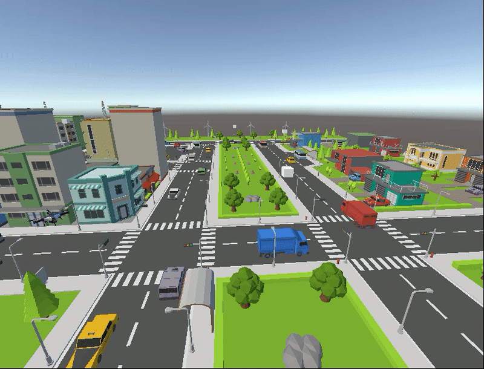

# AICourier — ML-Agents Installation & Training Guide
Welcome to our **Reinforcement Learning** course project where we will work with put into test all the materials learned throughout the semester into a `Unity` project alongisde the `ML-Agents` library. The project consists of an intelligent drone trained using `RL` algorithms, capable of getting to certain arbitrary destinations (represented with white cubes) placed in a *city-based* map without crashing with the other elements of the environment and in the quickest time possible.  

<p align="center">
  
</p>

This guide provides complete instructions for installing `Unity ML-Agents`, setting up the Python environment, and running training using your `hyperparams.yaml` file.

---

## Prerequisites

Make sure you have the following installed:

- **Conda** (Anaconda or Miniconda)
- **Unity Editor** (2021 LTS or another version compatible with ML-Agents 1.1.0)
- **Git** (Optional to clone the repository)
- **Cuda** (To use the GPU if available)

---

## 1. Create Conda Environment

Create a new environment using Python **3.10.12**:

```bash
conda create -n mlagents python=3.10.12
conda activate mlagents
```

## 2. Install ML-Agents
Install **ML-Agents version 1.1.0**:

```bash
python -m pip install mlagents==1.1.0
pip install onnx
```

In case this installation shows dependency problems, try with following guide:
[Installation | ML Agents](https://docs.unity3d.com/Packages/com.unity.ml-agents@4.0/manual/Installation.html)

It may still give you a bug in ML-Agents + Unity 6 with references to Google.Protobuf. If that is your situation edit the manifest.json file inside the Packages folder in your project changing the version of "com.unity.ml-agents" to "4.0.0".

## 3. Verify Installation
Run:
```bash
mlagents-learn --help
```
## 4. Unity Setup for the Project
1. Open the project in Unity.
2. Install or verify that the **ML-Agents Unity package** is present (Package Manager or manual import).
3. Ensure the scene is ready for training.

## 5. Running Training
We will use a certain flag to hide the graphical interface during training. Even if it is optional, it will speed the process considerably.

```bash
<training command> --no-graphics
```

In case there is an available `GPU`, we highly suggest to use it to considerably speed up the training process. Being configured with just a simple flag in the end of the command:

```bash
<training command> --torch-device=cuda
```

To speed up even more the training process, we will add a parallelization flag. Depending on the available `CPU`'s number of cores, the number indicated in the flag will have to change:

```bash
<training command> --num-envs=<number of CPU cores>
```
### 5.1 Standard Training
Make sure the `hyperparams.yaml` file is inside the project folder.Start training with (each training should have a different id)::
```bash
mlagents-learn hyperparams.yaml --run-id=DroneDeliveryRunId
```

The training results will be stored in (inside each subtraining folder identified with its unique identifier) when pressing the `Play` button inside the editor: 

```bash
results/DroneDeliveryRun/
```
### 5.2 Training with an Executable (**Recommended**)
To run an ML-Agents training using an executable (Build) instead of the Unity editor alongisde all the flags mentioned above:

#### 5.2.1 Executable Training in Windows
We will need the specific executable file for Windows (`.exe`) in order to start the training process: 
```bash
mlagents-learn hyperparams.yaml --env="Ejecutable/AIr Courier.exe" --run-id=DroneDeliveryRunId --no-graphics --torch-device=cuda --num-envs=<num_cores>
```
#### 5.2.2 Executable Training in Linux
The extension of the executable file will differ in Linux, being now `.x86_64`:
```bash
mlagents-learn hyperparams.yaml --env="Ejecutable/AIr Courier.x86_64" --run-id=DroneDeliveryRunId --no-graphics --torch-device=cuda --num-envs=<num_cores>
```
## 6. Project Structure 
```bash

AIrCourier/
├── AIr Courier              # Unity Project
├── README.md                # README.md file of the Github repository
├── TRAINING_INFERENCE_GUIDE.md  # Guide for fixing training-inference mismatch issues
├── hyperparams.yaml         # Hyperparameter configuration file for training
└── media                # Media files storing directory
```

## 7. Troubleshooting Training vs Inference Performance

If you experience a significant performance difference between training and inference (model works well during training but poorly in Unity), see the **[TRAINING_INFERENCE_GUIDE.md](TRAINING_INFERENCE_GUIDE.md)** for detailed explanations and solutions.

Common causes include:
- Time scale differences between training and inference
- Inconsistent observation normalization
- Physics timestep dependencies
- Unity project settings mismatches

## 8. Curriculum Learning

To bootstrap a new environment from a past training checkpoint just run:
```bash
mlagents-learn hyperparams.yaml --initialize-from=DroneDeliveryRunNoGraph12 --env="Executable2/AIr Courier.exe" --run-id=DroneDeliveryRunNoGraphv2_1 --no-graphics --torch-device=cuda --num-envs=7
```

"DroneDeliveryRunNoGraph12" is the folder that contains saved weights from a past training that we would like to use in this new training.
"DroneDeliveryRunNoGraphv2_1" is the place where we will save the results of this training.
